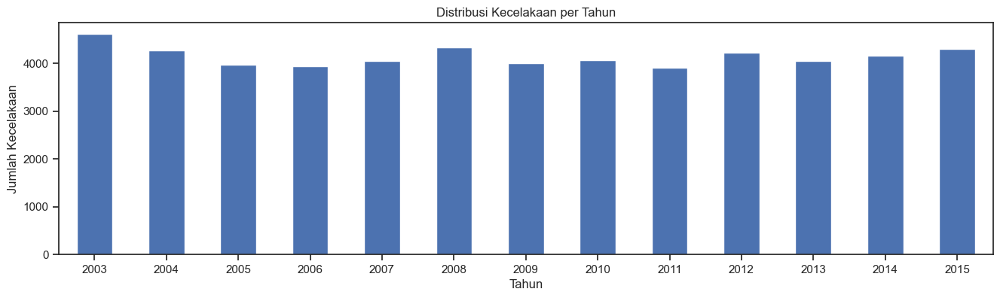
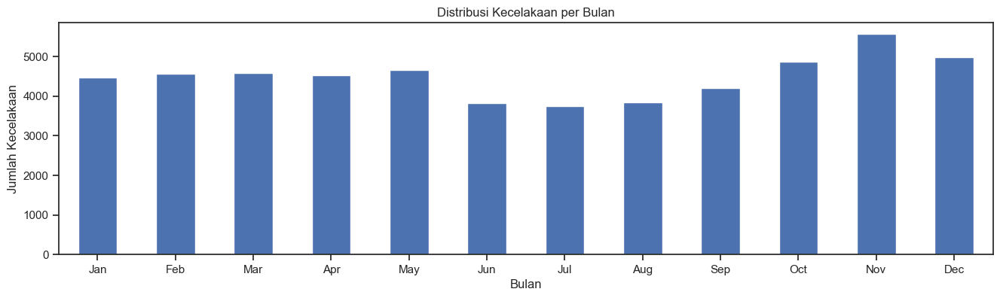
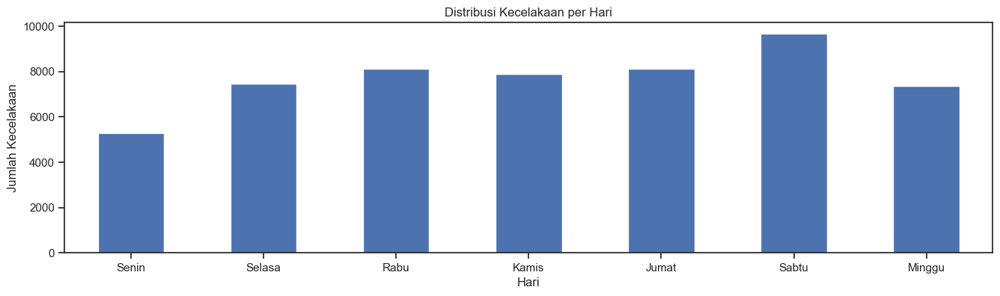
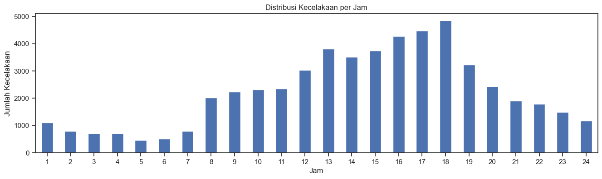
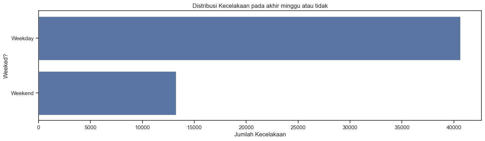
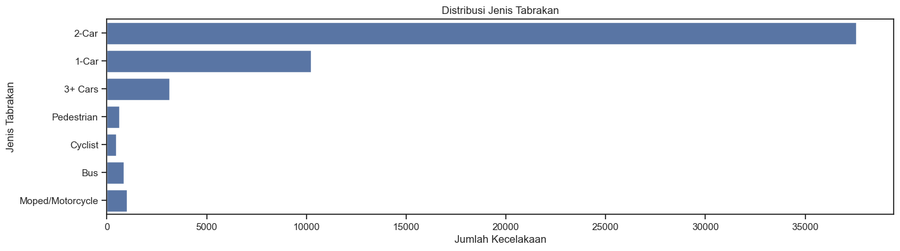
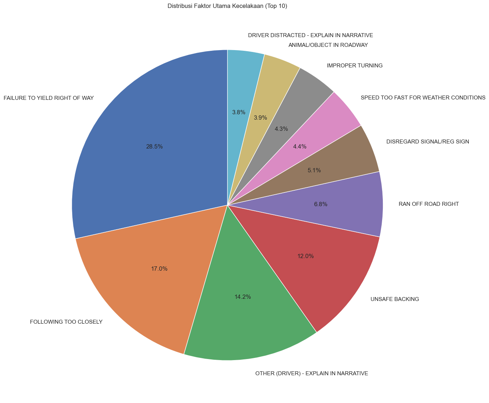
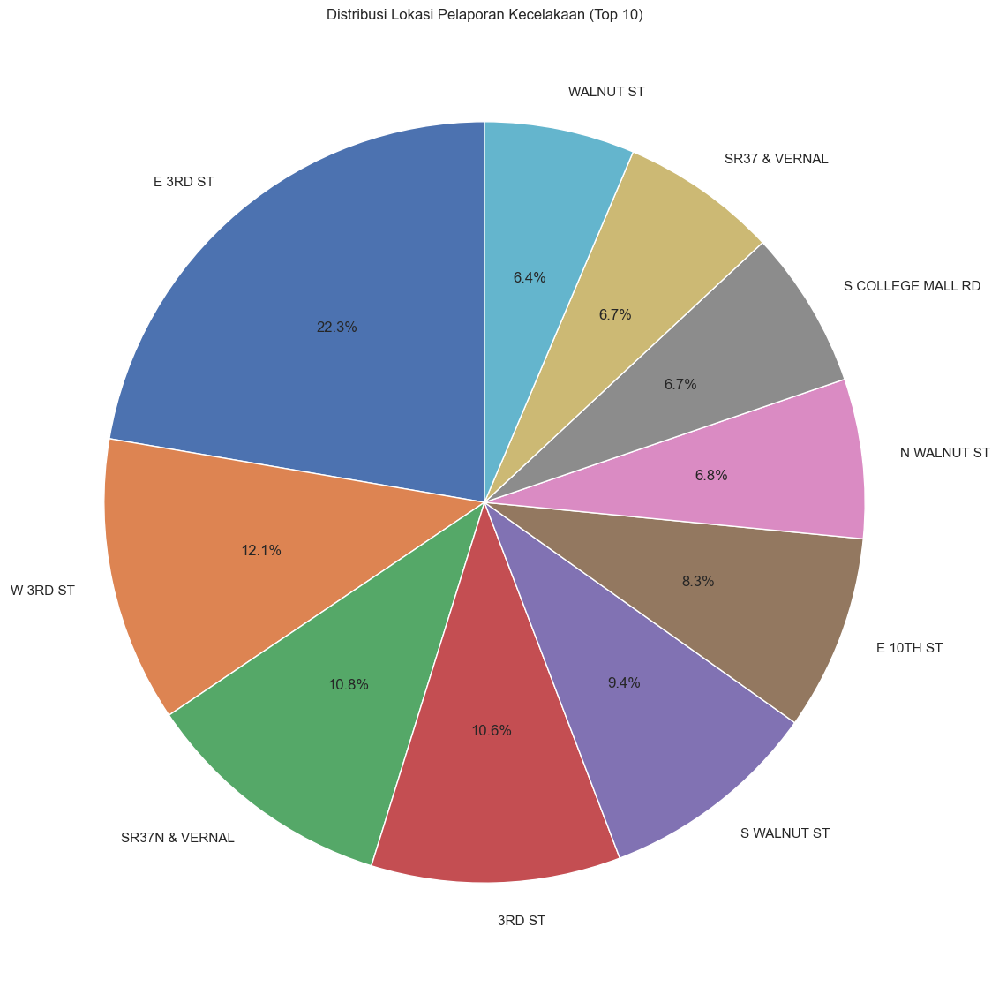
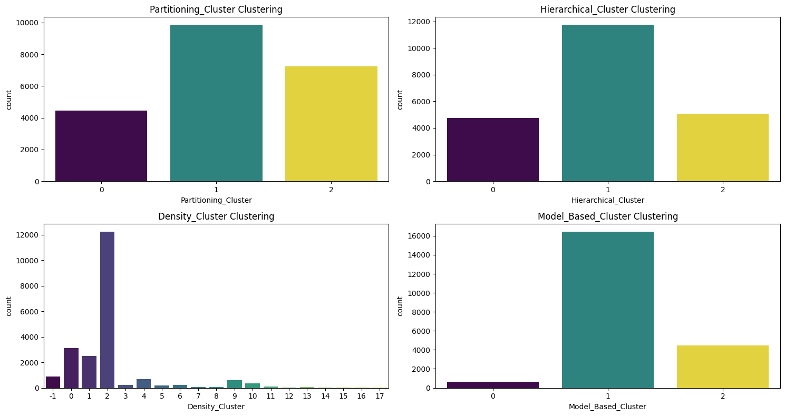

# Laporan Proyek Machine Learning - Taufik Abdullah

## Domain Proyek - Keamanan Lalu Lintas

Perkembangan _Machine Learning_ yang sangat pesat dapat membantu manusia dalam menyelesaikan permasalahan yang rumit dengan komputasi komputer. Pada proyek ini, penulis ingin menggunakan _Machine Learning_ untuk menganalisis data kecelakaan lalu lintas.

[Menurut WHO (1984)](https://www.kajianpustaka.com/2020/05/kecelakaan-lalu-lintas.html), kecelakaan lalu lintas adalah kejadian pada lalu lintas jalan yang sedikitnya diakibatkan oleh satu kendaraan yang menyebabkan cedera, kerusakan, atau kerugian pada pemiliknya atau korban. Kecelakaan lalu lintas merupakan kejadian yang sulit untuk diprediksi kapan dan dimana terjadinya. Kecelakaan tidak hanya mengakibatkan trauma, cidera, ataupun kecacatan, tetapi juga dapat mengakibatkan kematian. Kasus kecelakaan sulit diminimalisasi dan cenderung meningkat seiring pertambahan panjang jalan dan banyaknya pergerakan dari kendaraan.

Analisis kecelakaan lalu lintas sangat relevan dan berdampak besar terhadap keamanan masyarakat. [Menurut WHO](https://www.who.int/health-topics/road-safety#tab=tab_1), kecelakaan lalu lintas mengakibatkan kematian sekitar 1,19 juta orang di seluruh dunia setiap tahunnya dan menyebabkan antara 20 dan 50 juta orang mengalami cedera non-fatal, tidak hanya menimbulkan dampak manusiawi tetapi juga merugikan perekonomian nasional dengan kerugian mencapai sekitar 3% dari produk domestik bruto tahunan suatu negara. Dengan memahami dan memprediksi faktor-faktor yang menyebabkan kecelakaan, kita dapat mengambil langkah-langkah untuk meredakan kerusakan dan tingkat keparahannya2

### Fakta tentang Kecelakaan Lalu Lintas

Berikut adalah beberapa fakta tentang kecelakaan lalu lintas:
- Kebanyakan kecelakaan lalu lintas terjadi dalam radius 3 mil dari rumah.
- Penyebab paling umum dari kecelakaan lalu lintas adalah distraksi, kelelahan, kondisi lingkungan, dan gangguan medis atau emosional.
- Hampir 1,3 juta orang meninggal setiap tahun akibat kecelakaan lalu lintas.
- Ada sekitar 3.287 kematian akibat kecelakaan lalu lintas setiap hari.
- kecelakaan lalu lintas adalah penyebab kematian nomor 9 di dunia.

## _Business Understanding_

Berdasarkan latar belakang yang sudah dipaparkan sebelumnya, berikut rincian masalah yang dapat diselesaikan dalam proyek ini :

### _Problem Statements_

Menjelaskan pernyataan masalah latar belakang:
+ Apa pola waktu (hari, bulan, tahun) dari tabrakan?
+ Apa jenis tabrakan yang paling umum?
+ Apa faktor utama yang berkontribusi terhadap tabrakan?
+ Bagaimana cara membuat model _machine learning_ untuk mengklaster pola-pola kelompok kecelakaan

### _Goals_

Menjelaskan tujuan dari pernyataan masalah:
+ Menentukan pola waktu dari tabrakan.
+ Mengidentifikasi jenis tabrakan yang paling umum.
+ Mengetahui faktor utama yang berkontribusi terhadap tabrakan.
+ Mengetahui model yang lebih baik dalam mengklaster pola kelompok kecelakaan

### _Solution Statements_

1. Analisis Pola Waktu Tabrakan:
   + Mengumpulkan data historis tentang waktu dan tanggal tabrakan.
   + Melakukan analisis statistik untuk menentukan pola waktu (hari, bulan, tahun) dari tabrakan.
   + Menggunakan teknik visualisasi data untuk mempresentasikan pola tersebut secara jelas dan intuitif.

2. Identifikasi Jenis Tabrakan yang Paling Umum:
   + Mengumpulkan data tentang jenis dan keparahan tabrakan.
   + Melakukan analisis frekuensi untuk menentukan jenis tabrakan yang paling umum.
   + Menggunakan teknik visualisasi data untuk mempresentasikan hasil analisis ini.

3. Pengetahuan Faktor Utama yang Berkontribusi terhadap Tabrakan:
   + Mengumpulkan data tentang faktor utama tabrakan.
   + Melakukan analisis frekuensi untuk menentukan faktor utama tabrakan yang paling umum.
   + Menggunakan teknik visualisasi data untuk mempresentasikan hasil analisis ini.
   
4. Pengetahuan Faktor Utama yang Berkontribusi terhadap Tabrakan:
   + Mengidentifikasi dan mempertahankan atribut yang relevan
   + Melakukan _Subset Data, Encoding_ dan _Scaling_
   + Menerapkan algoritma pengelompokan _K-Means, Hierarchical Clustering, DBSCAN, dan GMM._
   + Evaluasi Performa menggunakan _Silhouette Score_ dan _Calinski-Harabasz Score_

## _Data Understanding_

_Dataset_ yang digunakan dalam proyek ini adalah [data kecelakaan mobil](https://www.kaggle.com/datasets/jacksondivakarr/car-crash-dataset/data) yang diambil dari platform kaggle.com yang dipublikasikan oleh Jackson Divakar R. Dataset ini memberikan informasi terperinci terkait faktor-faktor umum yang memengaruhi kecelakaan di jalan raya, seperti tingkat keparahan tabrakan, kondisi cuaca, jenis jalan, dan elemen-elemen yang berkontribusi, sehingga memberikan wawasan berharga untuk analisis dan peningkatan langkah-langkah keselamatan jalan raya secara keseluruhan, dengan atribut dataframe dapat dilihat pada Tabel 1.

Tabel 1, Atribut pada _Car Crash Dataset_
Atribut  | Keterangan | Tipe Data |
------------- | ------------- | --------------|
_Year_ | merepresentasikan tahun kejadian tabrakan | _integer_|
_Month_ | merepresentasikan bulan kejadian tabrakan | _integer_ |
_Day_ | merepresentasikan hari kejadian tabrakan | _integer_ |
_Weekend?_ | merepresentasikan apakah tabrakan terjadi di akhir pekan atau bukan | _object_ |
_Hour_ | merepresentasikan jam kejadian tabrakan. | _float_ |      
_Collision Type_ | merepresentasikan jenis tabrakan | _object_ |
_Injury Type_  | merepresentasikan jenis cedera | _object_ |
_Primary Factor_ |merepresentasikan faktor utama penyebab tabrakan | _object_ |
_Reported_Location_ |merepresentasikan lokasi kejadian tabrakan | _object_ |
_Latitude_ |merepresentasikan garis lintang lokasi kejadian | _float_ | 
_Longitude_ |merepresentasikan garis bujur lokasi kejadian | _float_ | 

Pada _dataset_ berisikan informasi sebanyak 53943 data dengan 11 kolom serta 68 data _Weekend?_, 225 data _Hour_, 6 data _Collision Type_, 1121 data _Primary Factor_, 35 data _Reported_Location_, 30 data _Latitude_ dan _Longitude_ terdapat _missing values_ serta 64 data duplikat.

### Visualisasi Data
Visualisasi persebaran data kecelakaan menunjukkan tren dan pola yang dapat memberikan wawasan penting terkait dengan kejadian kecelakaan lalu lintas. Berikut ini merupakan visualisasi persebaran data kecelakaan untuk atribut tahun bulan hari dan jam. 

1. Persebaran Kecelakaan Berdasarkan Tahun:
   - Grafik persebaran kecelakaan per tahun menunjukkan fluktuasi jumlah kecelakaan dari tahun 2003 hingga 2015. Peningkatan pada beberapa tahun tertentu dapat mengindikasikan periode tertentu dengan risiko lalu lintas yang lebih tinggi yang dapat dilihat pada Gambar 1.
  
  Gambar 1, Distribusi kecelakaan pertahun

2. Persebaran Kecelakaan Berdasarkan Bulan:
   - Grafik persebaran kecelakaan per bulan memberikan gambaran tentang pola musiman kecelakaan. Terlihat bahwa bulan Oktober memiliki jumlah kecelakaan tertinggi, sementara bulan Juni memiliki jumlah kecelakaan terendah yang dapat dilihat pada Gambar 2.
   
   Gambar 2, Distribusi kecelakaan perbulan

3. Persebaran Kecelakaan Berdasarkan Hari:
   - Grafik persebaran kecelakaan per hari menggambarkan variabilitas kecelakaan dalam seminggu. Analisis ini dapat membantu dalam menentukan apakah hari tertentu memiliki risiko kecelakaan yang lebih tinggi yang dapat dilihat pada Gambar 3.
   
  Gambar 3, Distribusi kecelakaan perhari

4. Persebaran Kecelakaan Berdasarkan Jam:
   - Grafik persebaran kecelakaan per jam menyoroti waktu-waktu tertentu dalam sehari yang mungkin memiliki tingkat kecelakaan yang lebih tinggi yang dapat dilihat pada Gambar 4.
  
  Gambar 4, Distribusi kecelakaan perjam
  
5. Persebaran Kecelakaan Berdasarkan Weekend dan Weekday:
   - Grafik persebaran antara weekend dan weekday membedakan kecelakaan yang terjadi selama hari kerja dan akhir pekan yang dapat dilihat pada Gambar 5.
  
  Gambar 5, Distribusi kecelakaan berdasarkan weekend atau tidak

6. Persebaran Tipe Kecelakaan:
   - Grafik persebaran jenis tabrakan memberikan informasi tentang jenis kecelakaan yang paling umum yang dapat dilihat pada Gambar 6.
  
  Gambar 6, Distribusi tipe kecelakaan

7. 10 Faktor Utama Penyebab Kecelakaan:
   - Grafik 10 faktor utama penyebab kecelakaan memberikan wawasan tentang faktor-faktor yang paling sering berkontribusi pada kecelakaan yang dapat dilihat pada Gambar 7.
  
  Gambar 7, 10 faktor utama penyebab kecelakaan

8. 10 Lokasi Tertinggi Kecelakaan Terjadi:
   - Grafik 10 lokasi tertinggi kecelakaan menyoroti area-area dengan jumlah kecelakaan tertinggi yang dapat dilihat pada Gambar 8.
  
  Gambar 8, 10 lokasi tertinggi kecelakaan terjadi

Melalui visualisasi ini, kita dapat mengidentifikasi pola dan faktor-faktor yang dapat menjadi dasar untuk mengembangkan strategi pencegahan dan peningkatan keselamatan lalu lintas.

## Data Preparation

 Dalam tahap pembersihan data, terdapat dua proses utama yang dilakukan pada _dataset Monroe County Car Crash_ 2003-2015. 

1. Duplikasi Data

    Berdasarkan hasil pemeriksaan, terdapat 64 baris data duplikat, kemudian dihapus menggunakan fungsi `drop_duplicates()` yang dapat dilihat pada Tabel 2.

    Tabel 2, Jumlah Duplikasi data 
    | Nama Data | Duplikasi | Duplikasi Tersisa |
    |------|-----------|-------------------|
    | _monroe county car crach 2003-2015_ | 64  | 0 |

    Penghapusan ini dilakukan untuk memastikan bahwa setiap baris dalam dataset adalah unik, mencegah potensi bias dan distorsi dalam hasil analisis. Dengan demikian, integritas dan konsistensi data dapat dijaga secara optimal. Pemilihan metode `drop_duplicates()` dilakukan karena kesederhanaan dan keterbacaan kode, memberikan implementasi yang efisien dan cepat eksekusi pada operasi penghapusan duplikat. Keputusan ini juga konsisten dengan praktik umum dalam analisis data menggunakan pandas.

2. _Missing value_
    
    Berdasarkan hasil pemeriksaan, terdapat beberapa _missing value_ pada beberapa atribut yang dapat dilihat pada Tabel 3.
    
    Tabel 3, Jumlah nilai data yang hilang
    _Attribute_  | _Missing Value_ | _Missing Value_ Tersisa
    ------------- | ------------- | ------------------
    _Year_ | 0 | 0
    _Month_ | 0 | 0
    _Day_ | 0 | 0
    _Weekend?_ | 68 | 0
    _Hour_ | 225 | 0      
    _Collision Type_ | 6 | 0
    _Injury Type_  | 0 | 0
    _Primary Factor_ | 1121 | 0
    _Reported_Location_ | 35 | 0
    _Latitude_ | 30 | 0
    _Longitude_ | 30 | 0

     _Missing value_ diatasi dengan menggunakan nilai median pada atribut kategorikal. Penggunaan median dipilih untuk menjaga konsistensi dan menghindari potensi distorsi data akibat imputasi nilai yang mungkin tidak sesuai. Proses ini diperlukan agar dataset menjadi lebih lengkap dan siap untuk tahapan analisis lebih lanjut. Pemilihan median dibandingkan dengan mean bertujuan untuk meminimalkan potensi distorsi akibat outlier dan menjaga konsistensi data. Keseluruhan, pembersihan data ini penting untuk memastikan dataset yang digunakan dalam analisis selanjutnya adalah lengkap, konsisten, dan siap digunakan.

### _Subset Data, Encoding, dan Scaling_
  
  a. _Subset Data_
        Melakukan pembentukan subset data dengan memilih kolom-kolom tertentu, yaitu `Hour`, `Collision Type`, `Injury Type`, dan `Primary Factor`. Kemudian, mengambil sebagian sampel (60%) dari _subset_ data tersebut menggunakan metode pengambilan sampel acak (_random sampling_) dengan _seed (random_state)_ 42.
        Pemilihan subset data dan pengambilan sampel dilakukan untuk mengurangi ukuran dataset (sistem tidak memiliki cukup memori untuk menangani ukuran data atau array dengan 100% sampel) dan memudahkan proses analisis. Pengambilan sampel juga dapat membantu dalam mengatasi masalah keterbatasan sumber daya komputasi.

  b. _Encoding_
        Selanjutnya, dilakukan proses encoding menggunakan `LabelEncoder` untuk mengubah nilai-nilai pada kolom-kolom kategorikal menjadi nilai numerik. Hal ini diperlukan agar model machine learning dapat memahami dan memproses data kategorikal.

  c. _Scaling_
        Kemudian  dilakukan proses _scaling_ menggunakan `StandardScaler`. _Scaling_ dilakukan untuk menormalkan skala nilai-nilai pada dataset, sehingga perbedaan skala antar atribut tidak mempengaruhi performa algoritma machine learning yang akan digunakan.

## _Modeling_
Algoritma pada _Machine Learning_ yang digunakan antara lain :

+ **_Partitioning_Cluster (K-Means Clustering)_**: Algoritma ini bekerja dengan mempartisi data menjadi sejumlah k kluster yang ditentukan sebelumnya. Pada kode ini, digunakan `sklearn.cluster.KMeans` dengan parameter `n_clusters=3` yang berarti membagi data menjadi tiga kluster. Parameter `n_init=10` berarti algoritma akan dijalankan 10 kali dengan centroid awal yang berbeda. Parameter `random_state=42` digunakan untuk memastikan hasil yang konsisten.

+ **_Hierarchical Clustering (Agglomerative Clustering)_**: Algoritma ini bekerja dengan memulai setiap titik data dalam kluster sendiri dan kemudian secara iteratif menggabungkan kluster yang paling dekat satu sama lain hingga jumlah kluster yang diinginkan tercapai. Pada kode ini, digunakan `sklearn.cluster.AgglomerativeClustering` dengan parameter `n_clusters=3` yang berarti data dibagi menjadi tiga kluster.

+ **_Density-based Clustering (DBSCAN)_**: Algoritma ini bekerja dengan mengelompokkan titik data yang dekat dalam ruang fitur menjadi kluster. Pada kode ini, digunakan `sklearn.cluster.DBSCAN` dengan parameter `eps=0.5` yang menentukan jarak maksimum antara dua sampel agar satu dapat dianggap berada di lingkungan yang sama. Parameter `min_samples=20` adalah jumlah minimum sampel dalam lingkungan untuk membentuk kluster.

+ **_Model-based Clustering (Gaussian Mixture Model)_**: Algoritma ini bekerja dengan mengasumsikan bahwa semua data berasal dari campuran distribusi Gaussian. Pada kode ini, digunakan `sklearn.mixture.GaussianMixture` dengan parameter `n_components=3` yang berarti diasumsikan ada tiga komponen Gaussian dalam data. Parameter `random_state=42` digunakan untuk memastikan hasil yang konsisten.

_K-Means Clustering_ memiliki kelebihan dalam kemudahan implementasi dan cocok untuk dataset besar, tetapi kekurangannya terletak pada sensitivitas terhadap inisialisasi centroid awal. Sementara itu, _Hierarchical Clustering_ menghasilkan dendrogram yang membantu interpretasi namun memerlukan komputasi intensif, lebih cocok untuk dataset kecil hingga menengah. _DBSCAN_ dapat menangani klaster berbentuk kompleks dan mengidentifikasi noise, namun sensitif terhadap parameter dan kurang cocok untuk dataset dengan variasi densitas yang signifikan. _Gaussian Mixture Model_ memiliki fleksibilitas dalam menangani distribusi non-sferis, tetapi sensitif terhadap inisialisasi parameter.

Hasil dari setiap model dapat dilihat pada Gambar 9.

Gambar 9. Hasil setiap model

## Evaluation

### Metrik Evaluasi yang Digunakan:
Ketika berurusan dengan tugas _clustering_, metrik evaluasi menjadi lebih subjektif dan bergantung pada tujuan analisis data. Dalam proyek ini, menggunakan beberapa metrik berikut:

1. **_Silhouette Score:_**
   - **Penjelasan:**
     - _Silhouette Score_ mengukur seberapa baik sebuah objek ditempatkan dalam kluster relatif terhadap kluster lainnya. Nilai _Silhouette Score_ berkisar dari -1 hingga 1. Nilai tinggi menunjukkan bahwa objek lebih baik cocok ke kluster mereka sendiri dan tidak sesuai dengan kluster tetangga.
   - **Formula:**
     $$S(i) = \frac{b(i) - a(i)}{\max\{a(i), b(i)\}}$$
     di mana $a(i)$ adalah jarak rata-rata objek ke objek lain dalam kluster yang sama, dan $b(i)$ adalah jarak rata-rata objek ke objek terdekat dalam kluster tetangga (kluster selain kluster objek tersebut).
   - **Interpretasi:**
     - Nilai _Silhouette Score_ mendekati 1 menunjukkan kluster yang baik, 0 menunjukkan tumpang tindih antar kluster, dan nilai negatif menunjukkan objek yang mungkin ditempatkan di kluster yang salah.

2. **_Calinski-Harabasz Index:_**
   - **Penjelasan:**
     - _Calinski-Harabasz Index_ adalah rasio dispersi antara kluster dan dispersi dalam kluster. Nilai yang lebih tinggi menunjukkan kluster yang lebih baik.
   - **Formula:**
     - $$CH = \frac{SSB / (k-1)}{SSW / (n-k)}$$
     di mana $SSB$ adalah variasi antara kluster, $SSW$ adalah variasi dalam kluster, $k$ adalah jumlah kluster, dan $n$ adalah jumlah sampel.
   - **Interpretasi:**
     - Semakin tinggi nilai _Calinski-Harabasz Index_, semakin baik klusteringnya.

### Hasil Proyek Berdasarkan Metrik Evaluasi:
- **_Silhouette Score_:**
  - KMeans: \(0.3300\)
  - Agglomerative Clustering: \(0.3138\)
  - DBSCAN: \(0.0982\)
  - Gaussian Mixture Model: \(0.3733)
- **_Calinski-Harabasz Index_:**
  - KMeans: \(10734.5449\)
  - Agglomerative Clustering: \(8588.1148\)
  - DBSCAN: \(1358.9695\)
  - Gaussian Mixture Model: \(6163.6951\)

Evaluasi clustering menggunakan metrik _Silhouette Score_ dan _Calinski-Harabasz Index_ memberikan wawasan yang berbeda terkait kualitas klustering dari empat metode yang digunakan (_KMeans, Agglomerative Clustering, DBSCAN, dan Gaussian Mixture Model_).

1. **_Silhouette Score_:**
   - **Interpretasi Hasil:**
     - Nilai _Silhouette Score_ untuk _Gaussian Mixture Model_ adalah yang tertinggi (\(0.3733\)), menunjukkan bahwa metode ini memberikan pembagian kluster yang baik dan objek dalam kluster memiliki jarak yang baik dengan objek di kluster lain.
     - Meskipun KMeans (\(0.3300\)) juga memiliki nilai yang baik, Agglomerative Clustering (\(0.3138\)) berada di antara KMeans dan DBSCAN (\(0.0982\)).
     - DBSCAN memiliki nilai Silhouette Score yang rendah, menunjukkan adanya tumpang tindih antar kluster atau objek yang mungkin ditempatkan di kluster yang salah.

   - **Implikasi Praktis:**
     - Tingginya Silhouette Score pada Gaussian Mixture Model menunjukkan bahwa model ini dapat digunakan dengan percaya diri untuk membagi data menjadi kluster yang bermakna. Oleh karena itu, dalam konteks aplikasi praktis, penggunaan Gaussian Mixture Model dapat memberikan hasil klustering yang lebih baik dalam hal keseragaman antar kluster.

2. **Calinski-Harabasz Index:**
   - **Interpretasi Hasil:**
     - Nilai Calinski-Harabasz Index tertinggi diperoleh oleh KMeans (\(10734.5449\)), mengindikasikan bahwa rasio dispersi antara kluster dan dispersi dalam kluster pada KMeans lebih baik dibandingkan metode lain.
     - Agglomerative Clustering memiliki nilai yang tinggi (\(8588.1148\)), tetapi lebih rendah dibandingkan dengan KMeans.
     - DBSCAN memiliki nilai yang jauh lebih rendah (\(1358.9695\)), menunjukkan bahwa metode ini mungkin tidak sesuai dengan struktur data secara keseluruhan.
     - Gaussian Mixture Model (\(6163.6951\)) berada di antara Agglomerative Clustering dan DBSCAN dalam hal indeks ini.

   - **Implikasi Praktis:**
     - Meskipun KMeans memiliki nilai Calinski-Harabasz Index tertinggi, pilihan antara KMeans dan Gaussian Mixture Model bergantung pada konteks aplikasi dan sifat data. KMeans cenderung menghasilkan kluster yang kompak, sedangkan Gaussian Mixture Model lebih fleksibel dan dapat menangani kluster dengan bentuk yang berbeda.

**Kesimpulan:**
1. Pola Tabrakan
    +  Tren tahunan menunjukkan fluktuasi insiden, mencapai puncak pada tahun 2015 dengan 4.313 kejadian dan terendah pada tahun 2003 dengan 4.625 kejadian. 
    + Analisis bulanan menyoroti tingginya jumlah insiden pada bulan Oktober (5.581 kejadian), diikuti oleh November (4.884 kejadian) dan September (4.994 kejadian). 
    + Saat mempertimbangkan aspek harian, hari ke-7 atau hari minggu dari setiap bulan menonjol sebagai hari dengan frekuensi insiden tertinggi (7.364 kejadian), sementara hari ke-1 memiliki jumlah insiden terendah (5.291 kejadian). 
    + Terakhir, analisis jam menunjukkan bahwa jam 23 adalah periode dengan jumlah insiden tertinggi (1.187 kejadian), diikuti oleh jam 22 dan 21. 
2. Jenis tabrakan
   + Sebagian besar insiden melibatkan "_2-Car_," yang mendominasi dengan jumlah signifikan mencapai 37.606 kasus. Kendaraan tunggal juga cukup umum, tercatat dalam kategori "_1-Car_" dengan 10.245 kasus. Tabrakan melibatkan lebih dari dua kendaraan ("_3+ Cars_") relatif lebih jarang, tercatat sebanyak 3.152 kasus. Kendaraan sepeda motor atau moped, tercakup dalam "_Moped/Motorcycle,_" terlibat dalam 1.007 insiden. Meskipun jumlahnya lebih rendah, keterlibatan sepeda motor tetap menjadi perhatian. Bus, pejalan kaki, dan pengendara sepeda juga terlibat dalam insiden, menunjukkan kompleksitas lalu lintas dengan berbagai jenis pengguna jalan. 
3. Faktor utama tabrakan
   + Ditemukan bahwa sebagian besar insiden lalu lintas disebabkan oleh perilaku pengemudi yang tidak mematuhi aturan, seperti "_FAILURE TO YIELD RIGHT OF WAY_" dan "_FOLLOWING TOO CLOSELY_." Alasan ini menyoroti perlunya kesadaran dan disiplin dalam berkendara. Selain itu, faktor-faktor keselamatan, seperti "_UNSAFE BACKING_" dan "_RAN OFF ROAD RIGHT_," menunjukkan kekhawatiran terhadap kondisi jalan dan perilaku berkendara yang dapat membahayakan. Kejadian terkait cuaca, seperti "_SPEED TOO FAST FOR WEATHER CONDITIONS_," juga menonjolkan pentingnya menyesuaikan kecepatan dengan kondisi lingkungan. Selain itu, ditemukan beberapa faktor terkait dengan gangguan pengemudi, seperti "_DRIVER DISTRACTED - EXPLAIN IN NARRATIVE_," yang menegaskan perlunya fokus dan kewaspadaan saat mengemudi. Adanya masalah terkait kondisi jalan, alkohol, atau kegagalan rem, seperti yang diindikasikan oleh "_ROADWAY SURFACE CONDITION_," "_ALCOHOLIC BEVERAGES_," dan "_BRAKE FAILURE OR DEFECTIVE_," juga menunjukkan perlunya pemeliharaan kendaraan dan pengawasan terhadap perilaku pengemudi.
4. Model Terbaik
    + Berdasarkan evaluasi menggunakan metrik _Silhouette Score_ dan Indeks Calinski-Harabasz, beberapa kesimpulan dapat diambil terkait kinerja empat metode klustering yang digunakan. Pertama, nilai _Silhouette Score_ menunjukkan bahwa Gaussian Mixture Model (GMM) memberikan pembagian kluster yang paling baik, dengan nilai tertinggi (\(0.3733\)). Meskipun KMeans juga memberikan hasil yang baik (\(0.3300\)), Agglomerative Clustering berada di antara KMeans dan DBSCAN (\(0.3138\)), sementara DBSCAN memiliki nilai yang rendah (\(0.0982\)), menunjukkan potensi tumpang tindih antar kluster atau penempatan objek yang kurang optimal.
    + Kedua, indeks Calinski-Harabasz menunjukkan bahwa KMeans memiliki kinerja yang sangat baik, dengan nilai tertinggi (\(10734.5449\)). Agglomerative Clustering juga memberikan hasil yang baik (\(8588.1148\)), sementara GMM (\(6163.6951\)) berada di tengah, dan DBSCAN (\(1358.9695\)) menunjukkan kinerja yang lebih rendah.
    + Secara keseluruhan, pilihan antara KMeans dan GMM tergantung pada kebutuhan aplikasi dan sifat data. Jika fokus pada pembentukan kluster yang kompak, KMeans dapat menjadi pilihan yang baik. Namun, jika data memiliki struktur yang kompleks atau kluster yang tidak terlalu terdefinisi, GMM dapat memberikan fleksibilitas yang lebih besar. Evaluasi ini memberikan pandangan yang holistik terhadap performa empat metode klustering dan dapat membantu dalam pemilihan model yang sesuai dengan tujuan analisis dan karakteristik data.

## Referensi

[1] "Machine Learning Terapan," Dicoding, 2024. [Online]. Available: https://www.dicoding.com/academies/319/tutorials/17052. [Accessed: 09-January-2024].

[2] "Road traffic injuries," World Health Organization (WHO), 2024. [Online]. Available: https://www.who.int/health-topics/road-safety#tab=tab_1. [Accessed: 10-January-2024].

[3] "Traffic accident analysis using machine learning paradigms," Academia.edu. [Online]. Available: https://www.academia.edu/30084706/Traffic_accident_analysis_using_machine_learning_paradigms. [Accessed: 09-January-2024].

